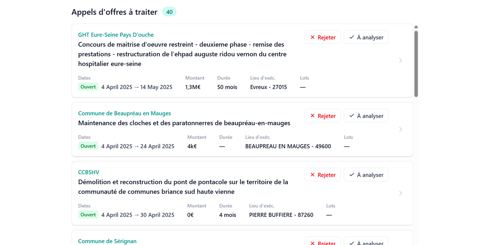

# Tengo Full Stack case

The stream feature: an infinite, virtualized list of tenders to triage, with reject / analyze decisions.



## Dev Quickstart

1. Clone the repo

```
git clone git@github.com:tender-cc/fullstack-case.git
cd fullstack-case
npm install
```

2.  Start the fake backend server :

```
cd backend-mock
node server.js
```

3. Start the front

```
npm start
```

## Context

`backend-mock`folder contains a mock of how our backend behaves.
It mainly has 2 tables (in memory for th purpose of the exercice - stored in file `database.js`)

- Tenders : the data that was collected about some tenders
- Interaction : table that contains the decision a user took about some tenders

There are 2 endpoints

- `POST /tenders/search` to get the tender matching the criterias. This endpoint has been simplified for the purpose of this exercice (for instance we don’t pass parameters to the search endpoint).
- `POST /interactions/decisionStatus` to take a decision on a tender and store it in the database

The content of the `src/` folder is a boilerplate React app. You have to adapt it to implement the stream feature.

## Tools & libraries used in the project

**Tooling**

- [Vite](https://vite.dev/) — bundler & dev server
- [React 19](https://react.dev/) + [TypeScript](https://www.typescriptlang.org/)
- [ESLint](https://eslint.org/) (with `typescript-eslint` and React Hooks plugins)
- [Orval](https://orval.dev/) — generates the React Query API client from the OpenAPI spec (`npm run api:generate`)

**Frontend**

- [TanStack Query](https://tanstack.com/query) — data fetching, caching & mutations
- [TanStack Virtual](https://tanstack.com/virtual) — virtualized infinite list
- [Tailwind CSS v4](https://tailwindcss.com/) (via `@tailwindcss/vite`) — styling
- [lucide-react](https://lucide.dev/) — icons
- [date-fns](https://date-fns.org/) — date formatting
